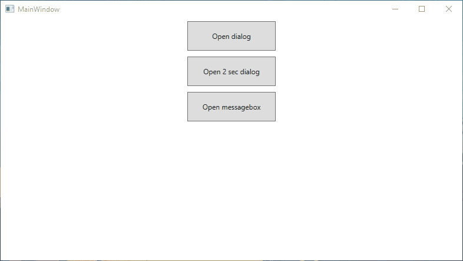
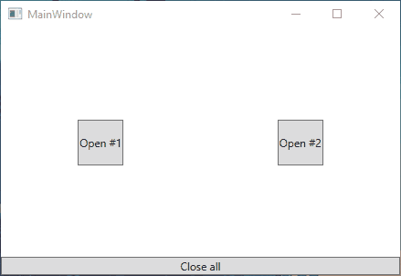

# MaterialDesignXaml.DialogsHelper

## Install-Package MaterialDesignXaml.DialogsHelper

### [Single DialogHost example](https://github.com/LiptonOlolo/MaterialDesignXaml.DialogsHelper/tree/master/Example)  

### [Multi DialogHost example](https://github.com/LiptonOlolo/MaterialDesignXaml.DialogsHelper/tree/master/MultiExample)  

